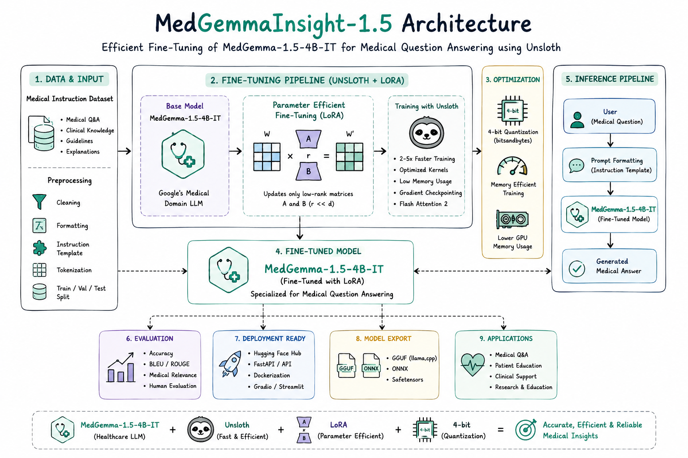

# MedGemmaInsight-1.5 - Less Memory. Better Medical Insights.

### Efficient Fine-Tuning of MedGemma-1.5-4B-IT for Medical Question Answering using Unsloth

  

<h1 align="center">MedGemmaInsight-1.5</h1>

<h3 align="center">
Fine-Tuning MedGemma-1.5-4B-IT for Medical Question Answering using Unsloth
</h3>

  
  
  
  
  
  

---

# Overview

**MedGemmaInsight-1.5** is a Medical Question Answering (Medical QA) model developed by fine-tuning **MedGemma-1.5-4B-IT** using **Unsloth** on a medical instruction dataset. The project demonstrates efficient adaptation of Google's latest healthcare-focused language model through LoRA, enabling faster training, lower GPU memory consumption, and accurate medical response generation.

---

# Features

* Medical Question Answering
* Fine-tuned MedGemma-1.5-4B-IT
* Efficient Fine-Tuning with Unsloth
* LoRA-based Parameter-Efficient Fine-Tuning
* Medical Instruction Dataset
* Memory-Efficient Training
* Context-Aware Medical Responses
* Ready for Inference & Deployment
* Optimized for Healthcare AI Applications

---

# Technology Stack

* Python
* PyTorch
* Hugging Face Transformers
* Unsloth
* TRL
* PEFT (LoRA)
* Accelerate
* BitsAndBytes
* Datasets

---

# Applications

* Medical Question Answering
* Healthcare AI Assistants
* Clinical Knowledge Support
* Patient Education
* Medical Information Retrieval
* Healthcare Research
* Biomedical AI Applications

---

# Model Efficiency

**MedGemma-1.5-4B-IT**, together with **Unsloth**, enables parameter-efficient fine-tuning using optimized kernels, LoRA, and 4-bit quantization. This significantly lowers GPU memory requirements while preserving the model's healthcare-specific knowledge, making fine-tuning practical on consumer GPUs.

### Benefits

* Faster Fine-Tuning
* Lower GPU Memory Usage
* Efficient LoRA Training
* 4-bit Quantization Support
* Faster Inference
* High-Quality Medical Responses

---

# Why MedGemma-1.5 + Unsloth?

**MedGemma-1.5** is designed specifically for healthcare and biomedical applications, providing a strong foundation for medical language understanding. By combining it with **Unsloth**, the model can be fine-tuned efficiently while reducing computational requirements and maintaining excellent medical reasoning performance.

### Highlights

* Memory-efficient fine-tuning
* Faster training with Unsloth
* LoRA-based parameter-efficient adaptation
* Lower GPU memory requirements
* Healthcare-specialized language model
* Ready for inference and deployment

This repository demonstrates an efficient workflow for adapting **MedGemma-1.5-4B-IT** using **Unsloth**, making advanced medical language models more accessible for healthcare AI research and real-world applications.

---

# Future Work

* Retrieval-Augmented Generation (RAG) for evidence-based medical responses
* Multi-turn Clinical Conversations
* Clinical Decision Support Systems
* Medical Report & Clinical Note Question Answering
* FastAPI REST API Deployment
* Hugging Face Spaces Demo
* GGUF & ONNX Export
* Edge Device & Mobile Deployment
